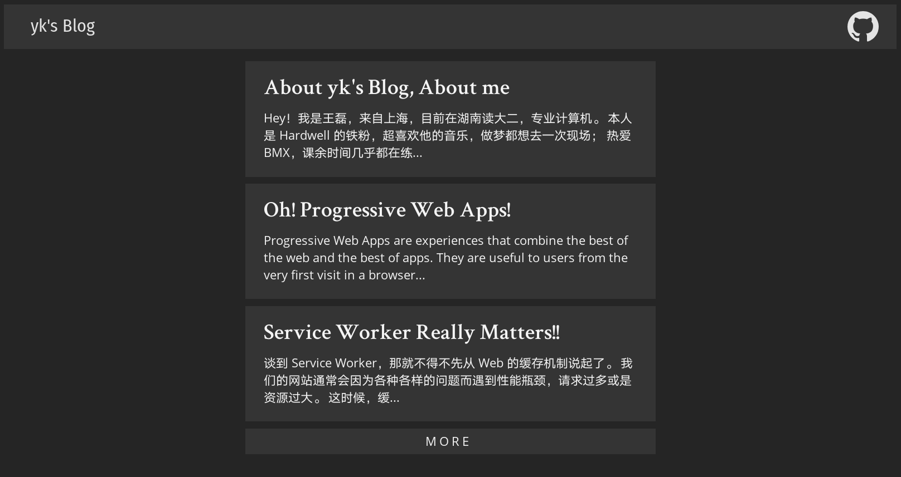

# [yk's Blog](https://m8524769.github.io/)

_Personal Blog, powered by Jekyll and Github Pages_

> Version: 1.0 Beta (Developing...) 
> 测试环境: Chrome 66 & Firefox Nightly 62

## 如何将该模板应用到自己的博客？？

### 第一步：点击页面右上角的 `Star` 按钮

这步其实并没什么卵用，只是给我加个 star 而已。

好吧算我求求你了给个 star 吧。。Orz

### 第二步：`Fork` Me!!

点击 `Fork` 之后进入 [Settings](../../settings) 页面，将 Repository name 改成 `<your username>.github.io`（这就是你的以后博客地址了）

这时你的博客就已经可以访问了，开不开心？

### 第三步：配置你的新博客

找到项目中的 [`_config.yml`](_config.yml) 并打开，点击 `History` 右边的编辑按钮，改完之后 `Commit` 一下就行了。

找到 [`_posts`](_posts) 目录，将里面我的文章删光光，以后你写的文章只要放在这个目录里就能自动生成其页面。

访问一下你的新博客试试看？

***

## 如何添加新文章？

进入刚才的 [`_posts`](_posts) 目录，点击 `Create new file`

注意文件的命名格式，例：`2018-5-3-blog-title.md`

另外，每篇文章都是要有 `YAML` 头信息的，就是三根虚线之间的内容，可以照搬我的模板。

下面的文章用 `Markdown` 语法来写就行了，同时还能预览，是不是很方便？

那么，上传你的第一篇文章吧！

***

## 深度定制化

很高兴你能看到这里，这年头愿意花时间读 `README` 的可不多了。

首先介绍一下，此博客模板是基于 Jekyll 和 Github Pages 的，所以要进一步定制的话就得具备相关知识，建议直接看[文档](https://jekyllrb.com/docs/home/)。

另外，建议熟练掌握 Git 以及 Gem/Bundler 包管理器的使用，前者是是必修课，后者能帮你避开很多坑（其实踩一遍才是最好的）。其中 Gem 和 Bundler 都是管理 Ruby 包的，类似于 npm 和 yarn，用过的会更好上手些，但依旧会有很多依赖上的麻烦。只要足够耐心，这都不是问题。

为何要讲到 Ruby？因为 Jekyll 的插件都是基于 Ruby 的，你想要为博客添加某个好用的插件，就得将插件写进 [`Gemfile`](Gemfile) 和 `_config.yml`，然后再用 Gem 安装。如果你是 Linux 用户，记住**千万不要** `$ sudo gem install ...` 相信我，会把你折腾死，别问我怎么知道的。还有，`$ gem update` 后如果出现依赖问题大多是因为 `Gemfile.lock` 没有同步，删掉后重新构建就行了。

关于页面样式，我是用 SASS 来写的。这货还是值得一学的，它可以帮你更加直观、快速地完成页面设计，为什么这么说？因为它支持 CSS 所没有的嵌套，变量以及模块化，使其维护起来更加方便省心。当然，如果你目前只会 CSS 的话，写进去也是完全没问题的。主要样式我放在 [`assets/css/main.scss`](assets/css/main.scss) 里面，其余模块则在 [`_sass/`](_sass) 目录下，添加新模块记得在 `main.scss` 里面 `@import` 进去。

网站图标的话，你直接替换掉 `favicon.ico` 就行了，另外，PWA 的 Logo 我放在 [`assets/images/logo/`](assets/images/logo) 里面，如果你想尝试 PWA 的话那还得改 [`manifest.json`](manifest.json)。

可能你想问：Github Pages 的博客能不能换域名啊？github.io 敲起来多麻烦。答案是：当然可以，但不怎么推荐。方法很简单，网上有很多教程，这里就不赘述了。为什么说不推荐呢？我们知道，GitHub Pages 是会给 github.io 提供免费 HTTPS 服务的，如果绑定自定义域名的话，就无法通过 HTTPS 来访问博客了，甚至会被浏览器标记为"不安全"，另一方面，Service Worker 的注册也是要 HTTPS 支持的，没有它，网站性能也会大打折扣。其实，你要绑定个域名然后再弄个 SSL 也不是不可以，只要你愿意折腾。

就逼逼这么多了，我要睡觉去了。。

***

## The MIT [License](LICENSE)

Copyright (c) 2017-2018, yk (m8524769@163.com)